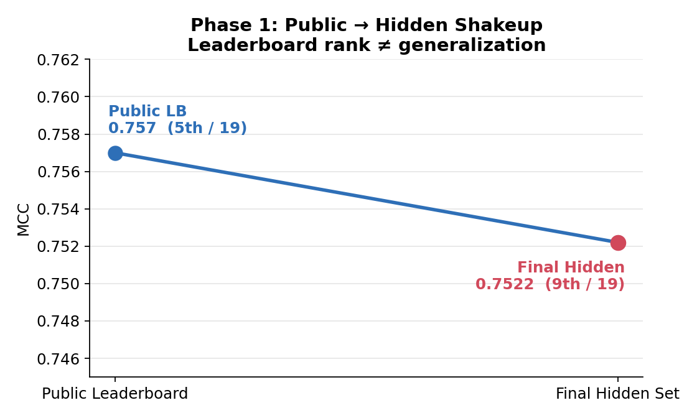
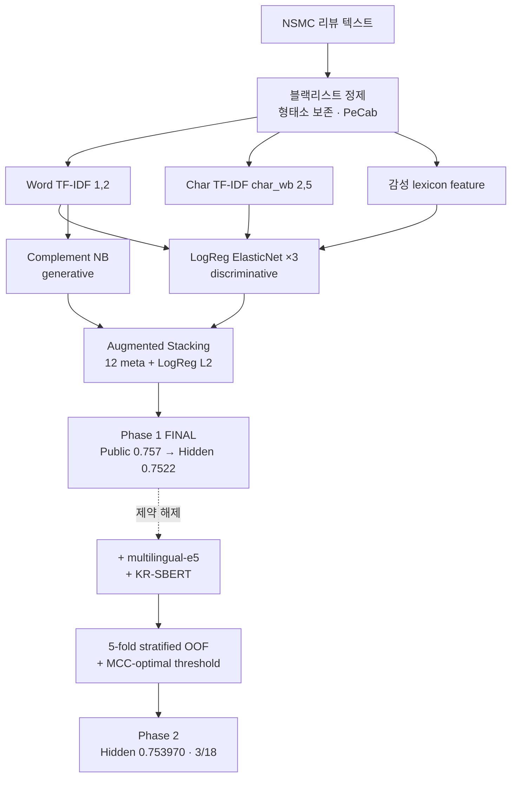
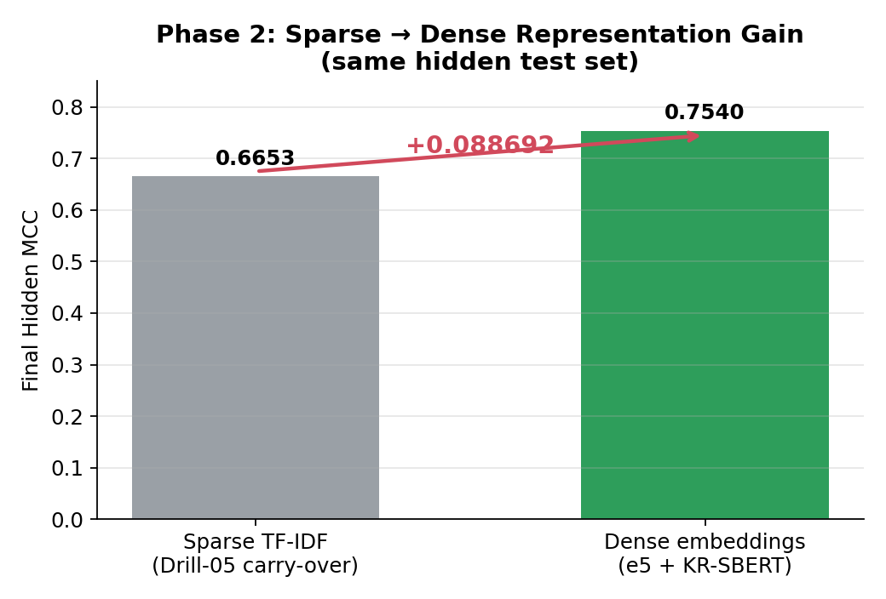
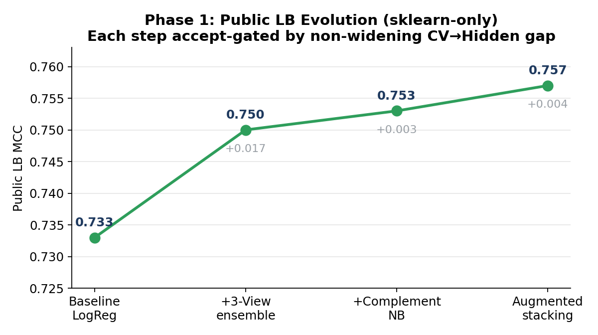
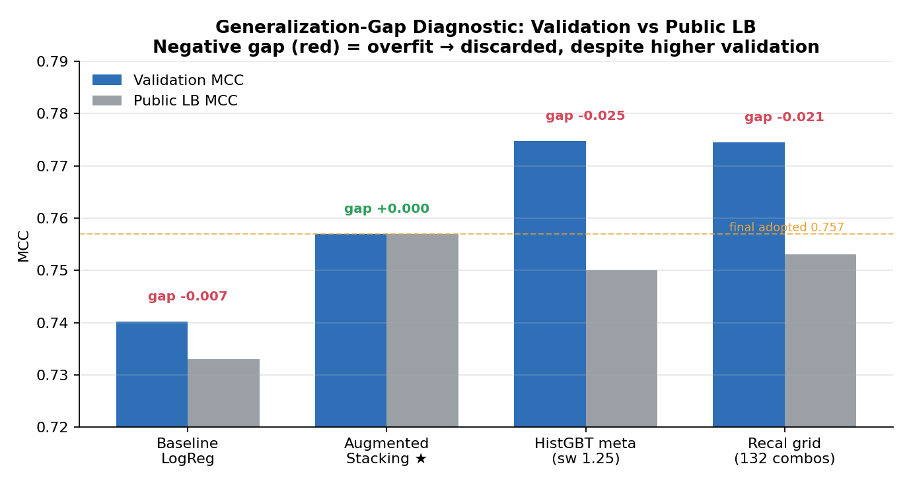

# Leaderboard Rank ≠ Generalization
### 한국어 영화 리뷰 감성 분류 — Public→Hidden 일반화 격차(Generalization Gap)를 관리한 실험 로그


<p align="center">
  <br>
  <sub><b>Figure 1.</b> Phase 1 셰이크업 — Public LB <b>0.757 (5위)</b>로 제출한 모델이 Final Hidden에서 <b>0.7522 (9위)</b>로 하락. 리더보드 순위는 일반화를 보장하지 않는다 — 이 프로젝트의 출발점.</sub>
</p>

> 📦 **데이터 미포함.** NSMC 계열 원본(`public_train.csv` 16 MB / `public_test.csv` 5 MB)은 용량·대회 자료 특성상 저장소에 포함하지 않음. 코드·문서·그림·결과표만 공개. → [`data/README.md`](data/README.md)

---

## 🎯 30초 요약 (TL;DR)

**질문 (Research Question).** "Public 리더보드에서 잘 나온 모델"이 정말 **처음 보는 데이터(hidden)** 에서도 잘 나오는가? 그리고 같은 과제에서 **sparse lexical(TF-IDF)** 과 **dense semantic(SentenceTransformer)** 표현 중 무엇이 더 일반화되는가?

**핵심 발견 (Key Findings).**
- 📉 Public 0.757(5위) → Final **Hidden 0.7522(9위)** 셰이크업 — validation·public 점수는 hidden 일반화를 보장하지 않음.
- 🧠 sparse → dense 전환으로 **동일 hidden 테스트 MCC +0.088692** (0.665278 → **0.753970**, Drill-06 **3/18**).
- 🧪 검증 점수가 **더 높았던** 모델(HistGBT meta, Val 0.7748)도 **CV→Hidden gap이 음수면 폐기** → 14개 실험 중 9개 폐기·5개 채택.

**내 역할 (My Role).** **개인 프로젝트.** 중간고사 과제(Phase 1) 수행 후 개인적으로 확장(Phase 2). 문제 정의·feature engineering·14개 실험 설계·stacking 아키텍처·일반화 분석 전 과정 수행.

**방법 (Method).** NSMC 150K · `scikit-learn`-only 3-View TF-IDF × Complement NB → Augmented Stacking → (제약 해제) multilingual-e5 × KR-SBERT + 5-fold OOF stacking · 평가 지표 **MCC**.

<sub>📖 목차: [질문](#연구-질문-research-question) · [데이터](#데이터-dataset) · [방법론](#방법론-methodology) · [설계 의사결정](#설계-의사결정-design-decisions--why) · [결과](#주요-결과-key-results) · [그림](#그림-figures) · [내 기여](#내-기여-my-contributions) · [한계·재현](#-한계--재현-limitations--reproducibility) · [구조](#저장소-구조-repository-structure)</sub>

---

## 연구 질문 (Research Question)

대부분의 입문 감성분류 프로젝트는 **validation 점수 한 줄**로 끝난다. 그러나 실제 대회에서는 제출 시점에 보이는 **Public LB**와 최종 채점되는 **Hidden(Private) LB**가 다르고, 이 둘의 차이가 모델의 진짜 가치를 가른다.

> **개인 내(in-sample) 신호** — "내가 본 데이터(CV·Public)에서 점수가 높은가?"
> **개인 외(out-of-sample) 신호** — "처음 보는 데이터(Hidden)에서도 점수가 유지되는가?"

이 프로젝트는 후자를 **1순위 선택 기준**으로 삼는다. 그리고 표현(representation) 관점에서 보조 질문을 던진다 — **sparse lexical** 표현과 **dense semantic** 임베딩 중 무엇이 더 잘 일반화되는가?

---

## 데이터 (Dataset)

| 항목 | 내용 |
|---|---|
| 자료원 | NSMC 계열 (Naver Sentiment Movie Corpus) — 한국어 영화 리뷰 |
| 규모 | train **149,995** / test **49,997** |
| 컬럼 | `row_id`, `text`, `label` |
| 클래스 균형 | NEGATIVE 75,170 / POSITIVE 74,825 (≈ **50.1% / 49.9%**) |
| 텍스트 특성 | 짧고 noisy한 구어체 — 반복 자모(`ㅋㅋㅋ`), 이모티콘(`ㅠㅠ`), 띄어쓰기 오류, **부정·어미 의존** |
| 평가 단위 | 리뷰 1건당 1개 라벨 예측 |

> ⚠️ 클래스가 거의 균형이라 accuracy도 쓸 수 있어 보이지만, 평가 지표는 **MCC** — 이유는 [설계 의사결정](#설계-의사결정-design-decisions--why) 참조.

---

## 방법론 (Methodology)



- **Phase 1 (sklearn-only).** 직교적 표현 3종(lexical 표면 · 문법 구조 · 의미 극성)과 이질적 모델 클래스(discriminative × generative)를 stacking으로 결합.
- **Phase 2 (제약 해제).** dense 임베딩 2종을 추가하고 5-fold OOF로 단일 split 신뢰성을 보강, threshold는 OOF에서만 sweep.

> 단계별 구현·하이퍼파라미터 근거: [`docs/02_methodology.md`](docs/02_methodology.md).

---

## 설계 의사결정 (Design Decisions — Why)

> 이 프로젝트의 핵심은 점수가 아니라 **"왜 그렇게 결정했는가"**. 모든 답은 실험 로그([`results/experiments_master.csv`](results/experiments_master.csv))·노트북·폐기 실험 기록([`docs/04`](docs/04_experiments_appendix.md))에 근거.

**Q1. 왜 MCC를 평가 지표로 썼는가?**
대회 공식 지표가 MCC였고, MCC는 confusion matrix 4칸(TP·TN·FP·FN)을 모두 반영하는 **Φ-coefficient**다. +1에 가까우려면 네 칸이 동시에 좋아야 하므로 두 클래스·두 오류 유형을 **대칭적으로** 평가한다.

**Q2. 왜 Accuracy를 주요 지표로 쓰지 않았는가?**
클래스가 ≈50:50이라 accuracy도 그럴듯해 보이지만, accuracy는 **한쪽으로 치우친 예측을 둔감하게** 넘기고 오류 유형을 비대칭 취급한다. MCC는 같은 상황에서 더 strict하며, 무엇보다 **대회 채점이 MCC**였다. 그래서 모델 선택·threshold 결정을 전부 **OOF 예측의 MCC**로 했다.

**Q3. 왜 3-View TF-IDF를 만들었는가?**
형태소 단독(morph-only) TF-IDF baseline이 **Public 0.733에서 정체**했다. 다양성을 **직교적 표현**에서 확보하기 위해 세 관점을 분리했다 — `word`(내용어·부정쌍), `char_wb`(오타·자모 반복·띄어쓰기 오류), `sentiment lexicon`(명시적 극성). 결과 **0.750 (+0.017)**.

**Q4. 왜 Complement NB를 포함했는가?**
SGD 변형 실험에서 배운 것 — *ensemble 이득은 옵티마이저 변형이 아니라 **모델 클래스 차이**에서 온다*(`average=False` SGD는 LogReg를 재현할 뿐이었다). 그래서 discriminative LogReg에 **generative** Complement NB를 더해 직교적 오류를 만들었다. 결과 **0.753 (+0.003)**.

**Q5. 왜 일부 고성능 모델을 최종 선택하지 않았는가?**
HistGBT meta learner는 **Val 0.7748**로 가장 높았지만 **LB 0.750** — 30K×16 메타데이터에서 명백한 **음의 gap(overfit)**. recalibration grid(132조합)도 Val 0.7745 / LB ≤0.753. 검증 점수가 아니라 **CV→Hidden gap의 부호**가 선택 기준이므로 단순한 **linear meta(LogReg L2)** 를 채택했다.

**Q6. 왜 Generalization Gap 분석을 수행했는가?**
Phase 1에서 Public 0.757(5위)이 Hidden 0.7522(9위)로 떨어지는 **셰이크업을 직접 겪었기 때문**. 이 사건이 "validation·public ≠ hidden"을 실증했고, 이후 gap 부호를 1순위 기준으로 삼아 Phase 2를 **5-fold OOF**로 재설계했다.

---

## 주요 결과 (Key Results)

| Phase | 트랙 | Public LB | Final Hidden MCC | 순위 |
|---|---|---|---|---|
| 1 (중간고사) | sklearn-only stacking | 0.757 (public 5위) | **0.7522** | **9 / 19** |
| 2 (Drill-06 확장) | TF-IDF × e5 × KR-SBERT | — | **0.753970** | **3 / 18** |

**sparse → dense 표현 이득** — 동일 hidden 테스트에서 +0.088692.

<p align="center">
  <br>
  <sub><b>Figure 2.</b> Drill-06 캐리오버 baseline(sparse TF-IDF) 0.665278 → dense 임베딩 stacking <b>0.753970</b>.</sub>
</p>

<details>
<summary><b>모델 발전 과정 · 일반화 격차 진단 (그림 펼치기)</b></summary>

<br>

<p align="center"><br>
<sub><b>Figure 3.</b> Phase 1 Public LB 0.733 → 0.757, 각 단계는 gap이 벌어지지 않을 때만 채택.</sub></p>

<p align="center"><br>
<sub><b>Figure 4.</b> Val vs Public LB — 검증 점수가 가장 높았던 두 실험(HistGBT, recal grid)이 가장 큰 <b>음의 gap</b>으로 폐기.</sub></p>

> 전체 14개 실험 로그: [`results/experiments_master.csv`](results/experiments_master.csv) · 폐기 실험 카드: [`docs/04`](docs/04_experiments_appendix.md).

</details>

### Error Analysis (요약)

튜닝보다 **오류 분석이 설계를 이끌었다**.

- **과전처리** — POS 화이트리스트가 어미(시제·존칭)를 제거 → 블랙리스트 정제로 전환.
- **솔버 등가 함정** — `average=False` SGD는 LogReg 재현 → 다양성은 모델 클래스에서.
- **메타 과적합** — HistGBT meta Val 0.7748 / LB 0.750(음의 gap) → linear meta.
- **Threshold zero-sum** — calibrated 모델은 0.5 유지, sweep은 OOF에서만.

> 전체 일반화·오류 분석: [`docs/05_generalization_analysis.md`](docs/05_generalization_analysis.md).

---

## 그림 (Figures)

| 파일 | 내용 |
|---|---|
| [`fig1_public_hidden_shakeup.png`](figures/fig1_public_hidden_shakeup.png) | Public→Hidden 셰이크업 (Hero) |
| [`fig3_sparse_vs_dense.png`](figures/fig3_sparse_vs_dense.png) | sparse vs dense 표현 이득 (+0.0887) |
| [`fig2_lb_evolution.png`](figures/fig2_lb_evolution.png) | Phase 1 Public LB 발전 과정 |
| [`fig5_generalization_gap.png`](figures/fig5_generalization_gap.png) | Val vs LB 일반화 격차 진단 |
| [`fig4_pipeline.png`](figures/fig4_pipeline.png) | 3-View → 4-Model → Stacking 파이프라인 |
| [`fig6_threshold_curve.png`](figures/fig6_threshold_curve.png) | Phase 2 OOF MCC-optimal threshold sweep |

---

## 내 기여 (My Contributions)

> 개인 프로젝트(중간고사 + 개인 확장). 아래는 **면접에서 방어 가능한** 범위로 한정했고, 각 항목은 저장소의 노트북·결과와 연결된다.

| 영역 | README/CV에 쓸 수 있는 표현 | 면접에서 설명 가능한 내용 |
|---|---|---|
| 문제 정의 | 단순 분류를 일반화 격차 관리 문제로 재정의 | 왜 Public≠Hidden인지, gap 부호가 왜 선택 기준인지 |
| Feature engineering | 3-View TF-IDF + 감성 lexicon, 형태소 정책 결정 | blacklist > whitelist 이유(어미 정보 손실) |
| 모델링 | discriminative × generative stacking 구성 | ensemble 다양성이 모델 클래스에서 오는 이유 |
| 실험 설계 | 14개 실험(채택 5/폐기 9) CV·LB·gap 로깅 | HistGBT meta를 *왜* 폐기했는지(음의 gap) |
| 확장 | SentenceTransformer + 5-fold OOF stacking | sparse→dense가 +0.0887을 만든 이유 |

**정직한 경계 (Honest boundary).** 어떤 결과도 SOTA·프로덕션급으로 표현하지 않음 · Phase 1 순위(9/19)는 셰이크업 *후* 결과로 그대로 공개 · 폐기 실험 일부는 CV만 측정(hidden 미평가) · "first author / lead analyst" 같은 논문 직함은 코스 프로젝트라 사용하지 않음.

---

## 📂 한계 · 재현 (Limitations · Reproducibility)

<details>
<summary><b>한계 (Limitations)</b></summary>

<br>

1. **단일 split (Phase 1)** — 단일 train/val split 신뢰성 한계 → Phase 2에서 5-fold OOF로 보완.
2. **부분 측정** — 폐기 실험 일부는 비용 제약으로 CV만 측정, hidden 미평가.
3. **유의성 미검정** — 점수 차이의 통계적 유의성·신뢰구간 미수행.
4. **fine-tuning 미비교** — frozen embedding stacking vs LoRA 등 PEFT 비교 미수행 → [향후 과제](docs/07_lessons_learned.md).
5. **코스 범위** — 배포·서빙·실시간 추론은 대상 외.

</details>

<details>
<summary><b>재현 (Reproducibility)</b></summary>

<br>

```bash
git clone https://github.com/USERNAME/korean-sentiment-generalization.git
cd korean-sentiment-generalization
python -m venv .venv && source .venv/bin/activate   # Python 3.11
pip install -r requirements.txt
# data/README.md 안내대로 public_train.csv / public_test.csv 배치
jupyter notebook notebooks/phase1_sklearn_stacking.ipynb   # Phase 1 (CPU OK, Colab T4 ~90분)
jupyter notebook notebooks/phase2_embedding_stacking.ipynb # Phase 2 (GPU 필수)
```

- `SEED=42` 고정 · fold별 vectorizer/scaler 재fit(leakage 차단) · threshold sweep은 OOF 한정.
- 전체 체크리스트: [`docs/09_repro_checklist.md`](docs/09_repro_checklist.md).

[](https://colab.research.google.com/github/jiwooo411/korean-sentiment-generalization/blob/main/notebooks/phase2_embedding_stacking.ipynb)

</details>

---

## 저장소 구조 (Repository Structure)

```
.
├── README.md    
├── LICENSE · requirements.txt · .gitignore
├── data/        # 📦 README만 — 원본 미포함 (출처·획득 안내)
├── notebooks/   # phase1_sklearn_stacking · phase2_embedding_stacking
├── docs/        # 01~09 심화 문서 (방법론·실험·일반화·교훈) + 색인
├── figures/     # fig1~fig6 + social_preview
└── results/     # experiments_master.csv · ensemble_3view_results.csv
```

> 대용량·내부 파일(`log/` 1.5 GB, `*.pkl`, 임베딩 `*.npy`, 원본 데이터, 강의 자료)은 `.gitignore`로 공개 트리에서 제외 — 로컬 보존.
> 본 프로젝트는 **노트북 기반**이므로 KYHPS식 `src/`·`scripts/` 분리 대신 재현 가능한 노트북 2개를 정본으로 둠(테스트 불가한 추출 코드를 만들지 않기 위함).

---

## 참고문헌 (References)

1. Matthews, B. W. (1975). Comparison of the predicted and observed secondary structure of T4 phage lysozyme. *Biochimica et Biophysica Acta*, 405(2), 442–451. *(MCC)*
2. Zou, H., & Hastie, T. (2005). Regularization and variable selection via the elastic net. *JRSS-B*, 67(2), 301–320.
3. Rennie, J. D. M., Shih, L., Teevan, J., & Karger, D. R. (2003). Tackling the poor assumptions of naive Bayes text classifiers. *ICML*. *(Complement NB)*
4. Wang, L., et al. (2022). Text embeddings by weakly-supervised contrastive pre-training. *arXiv:2212.03533*. *(multilingual-e5)*
5. Park, E. (NSMC). Naver Sentiment Movie Corpus. <https://github.com/e9t/nsmc>

---

<sub>NSMC 한국어 영화 리뷰 감성 분류 · 코드 MIT, 원자료 미배포 · 문의: jiwooo411@naver.com</sub>
