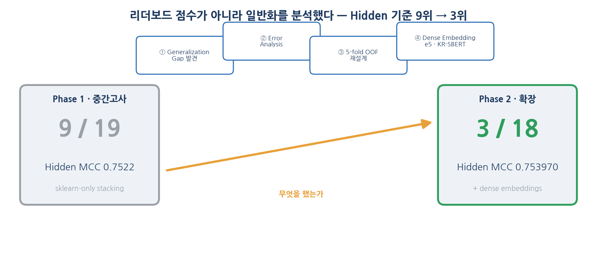
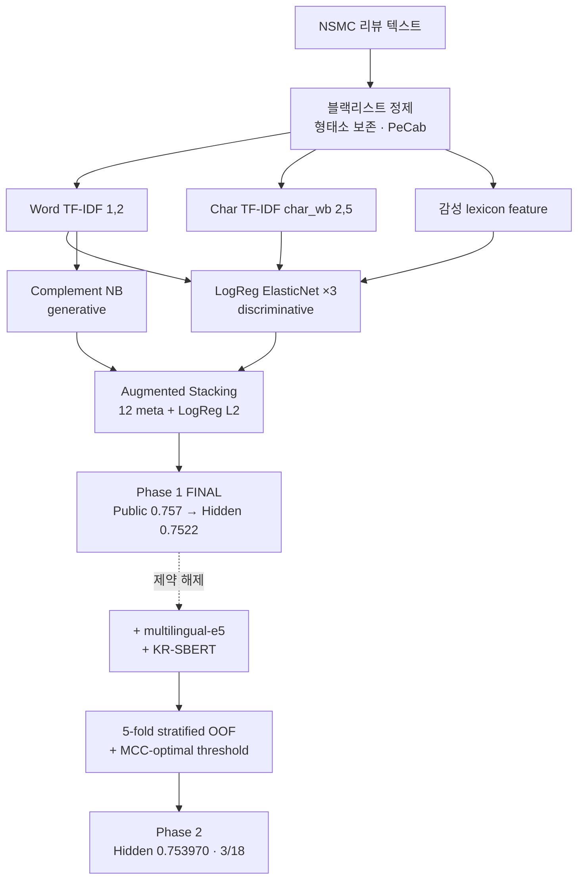

# Korean Sentiment Classification
### Leaderboard Rank ≠ Generalization

**Public Leaderboard does not guarantee Hidden Generalization.**

한국어 영화 리뷰 감성 분류에서 Public→Hidden 일반화 격차를 분석하고, 일반화 성능을 기준으로 모델을 선택한 실험 프로젝트


<p align="center">
  <br>
  <sub><b>Figure 1.</b> Phase 1 Hidden <b>9위</b> → 일반화 격차 분석(Error Analysis · 5-fold OOF 재설계 · dense embedding) → Phase 2 Hidden <b>3위 (MCC 0.753970)</b>. 리더보드 점수가 아니라 일반화 문제를 분석해 순위를 끌어올린 과정.</sub>
</p>

> 원본 데이터(NSMC, 약 21 MB)는 용량·대회 자료 특성상 미포함. 코드·문서·그림·결과표만 공개. → [`data/README.md`](data/README.md)

---

## 30초 요약

**질문.** Public 리더보드 상위 모델이 처음 보는 hidden 데이터에서도 유지되는가. 그리고 sparse(TF-IDF)와 dense(SentenceTransformer) 표현 중 무엇이 더 일반화되는가.

**핵심 발견.**
- Public 0.757(5위) → Final Hidden 0.7522(9위) 셰이크업 — validation·public은 hidden을 보장하지 않음.
- sparse → dense 전환으로 동일 hidden 테스트 **+0.088692** (0.665278 → **0.753970**, 3/18).
- 검증 점수가 더 높아도 CV→Hidden gap이 음수면 폐기 — 14개 실험 중 9개 폐기·5개 채택.

**내 역할.** 개인 프로젝트. 중간고사 과제(Phase 1) 후 개인 확장(Phase 2). 문제 정의·feature engineering·14개 실험 설계·stacking·일반화 분석 전 과정 수행.

**방법.** NSMC 150K · 3-View TF-IDF × Complement NB → Augmented Stacking → (제약 해제) multilingual-e5 × KR-SBERT + 5-fold OOF stacking · 지표 MCC.

**의미.** 이 프로젝트는 모델 성능을 높이는 것보다 **일반화 성능을 기준으로 의사결정을 내리는 실험 설계**를 목표로 했다.

---

## 왜 중요한가?

대부분의 감성분류 프로젝트는 **Validation 점수나 Public Leaderboard 순위 향상**에 초점.

이 프로젝트는 **처음 보는 Hidden 데이터에서의 일반화 성능 검증**을 중심으로 설계.

가장 높은 점수가 아니라 **일반화 성능을 기준으로 모델을 선택하는 실험 설계와 의사결정 과정 제시**가 핵심.

---

## 동기

Phase 1에서 Public LB 0.757(5위)로 제출한 모델이 Final Hidden 0.7522(9위)로 하락. "public 점수만 믿으면 안 된다"를 실증한 사건이자 이후 모든 의사결정의 출발점. 이때부터 **CV→Hidden gap 부호를 1순위 선택 기준**으로 삼음.

<p align="center">
  <br>
  <sub><b>Figure 2.</b> Public LB <b>0.757 (5위)</b> 제출 모델이 Final Hidden <b>0.7522 (9위)</b>로 하락. 리더보드 순위는 일반화를 보장하지 않음.</sub>
</p>

---

## 데이터

| 항목 | 내용 |
|---|---|
| 자료원 | NSMC 계열 (Naver Sentiment Movie Corpus) — 한국어 영화 리뷰 |
| 규모 | train 149,995 / test 49,997, 클래스 ≈ 50.1% / 49.9% |
| 텍스트 특성 | 짧고 noisy한 구어체 — 반복 자모(`ㅋㅋㅋ`), 이모티콘(`ㅠㅠ`), 띄어쓰기 오류, 부정·어미 의존 |

> 클래스가 균형이라 accuracy도 쓸 수 있어 보이지만 지표는 MCC. 이유는 [설계 의사결정](#설계-의사결정) 참조. 컬럼·획득 안내: [`data/README.md`](data/README.md).

---

## 기술 스택

| 구분 | 도구 |
|---|---|
| 언어 | Python 3.11 |
| 전통 ML | scikit-learn — LogReg ElasticNet · Complement NB · Stacking |
| 임베딩 | sentence-transformers (multilingual-e5 · KR-SBERT), PyTorch |
| 한국어 처리 | PeCab (형태소 정제) |
| 평가 | MCC — 모델 선택·threshold 결정 기준 |
| 시각화 | matplotlib · koreanize-matplotlib |

---

## 방법론



- **Phase 1 (sklearn-only).** 직교 표현 3종(표면·구조·극성)과 이질 모델 클래스(discriminative × generative)를 stacking으로 결합.
- **Phase 2 (제약 해제).** dense 임베딩 2종 추가, 5-fold OOF로 단일 split 보강, threshold는 OOF에서만 sweep.

> 단계별 구현·하이퍼파라미터 근거: [`docs/02_methodology.md`](docs/02_methodology.md).

---

## 설계 의사결정

> 핵심은 점수가 아니라 "왜 그렇게 결정했는가". 모든 결정은 실험 로그·폐기 실험 기록에 근거.

| 결정 | 이유 |
|---|---|
| 지표를 MCC로 | 대회 공식 지표이자 confusion matrix 4칸을 대칭 평가. accuracy는 균형 데이터에서도 편향 예측에 둔감 → 모델·threshold 선택을 전부 OOF MCC로 수행 |
| 3-View TF-IDF 구성 | morph 단독 baseline이 Public 0.733에서 정체 → word·char_wb·감성 lexicon 직교 표현으로 분리, **0.750 (+0.017)** |
| Complement NB 추가 | 다양성은 옵티마이저 변형이 아니라 모델 클래스 차이에서 발생 → discriminative에 generative 결합, **0.753 (+0.003)** |
| linear meta 채택 | HistGBT meta는 Val 0.7748로 최고였으나 LB 0.750(음의 gap, overfit) → 단순 LogReg L2 선택 |
| gap 부호를 선택 기준으로 | Public 0.757→Hidden 0.7522 셰이크업 경험 → 검증 점수 대신 CV→Hidden gap 부호로 채택 판단, Phase 2를 5-fold OOF로 재설계 |

> 채택 실험 5개·폐기 실험 9개 전체 근거: [`docs/03`](docs/03_experiments_main.md) · [`docs/04`](docs/04_experiments_appendix.md) · [`docs/05`](docs/05_generalization_analysis.md).

---

## 주요 결과

| Phase | 트랙 | Public LB | Final Hidden MCC | 순위 |
|---|---|---|---|---|
| 1 (중간고사) | sklearn-only stacking | 0.757 (5위) | **0.7522** | **9 / 19** |
| 2 (확장) | TF-IDF × e5 × KR-SBERT | — | **0.753970** | **3 / 18** |

<p align="center">
  <br>
  <sub><b>Figure 3.</b> sparse TF-IDF baseline 0.665278 → dense 임베딩 stacking <b>0.753970</b> (동일 hidden, +0.088692).</sub>
</p>

<details>
<summary><b>모델 발전·일반화 격차 진단 그림</b></summary>

<br>

<p align="center"><br>
<sub><b>Figure 4.</b> Phase 1 Public LB 0.733 → 0.757, 각 단계는 gap이 벌어지지 않을 때만 채택.</sub></p>

<p align="center"><br>
<sub><b>Figure 5.</b> Val vs Public LB — 검증 점수가 가장 높았던 두 실험(HistGBT, recal grid)이 가장 큰 음의 gap으로 폐기.</sub></p>

> 그림별 설명: [`figures/README.md`](figures/README.md) · 전체 실험 로그: [`results/experiments_master.csv`](results/experiments_master.csv).

</details>

**Error Analysis가 설계를 주도.**

| 발견한 문제 | 개선 |
|---|---|
| 형태소 whitelist가 어미 정보를 제거 | blacklist 기반 전처리 |
| Solver 변경은 다양성을 만들지 못함 | 모델 클래스 다양성 확보 (discriminative × generative) |
| HistGBT meta overfitting (Val 최고, LB 음의 gap) | Linear meta (LogReg L2) 채택 |
| Validation 점수 기준 선택은 셰이크업에 취약 | OOF 기반 threshold·gap 부호로 선택 |

상세: [`docs/05`](docs/05_generalization_analysis.md).

---

## 개인 프로젝트

> 개인 프로젝트

| 영역 | 주요 |
|---|---|
| Problem Definition | 단순 분류를 Generalization Gap 관리로 재정의 |
| Feature Engineering | 3-View TF-IDF + Sentiment Lexicon, blacklist 기반 전처리 |
| Modeling | Discriminative × Generative Stacking |
| Experiment Design | 14개 실험 설계 및 비교 (채택 5 · 폐기 9) |
| Generalization Analysis | CV→Hidden Gap 기반 모델 선택, sparse→dense +0.0887 |

**정직한 경계.** 어떤 결과도 SOTA·프로덕션급으로 표현하지 않음 · Phase 1 순위(9/19)는 셰이크업 후 결과 그대로 공개 · 폐기 실험 일부는 CV만 측정 · 논문 직함은 코스 프로젝트라 미사용.

---

## Key Takeaway

이 프로젝트를 통해 얻은 가장 큰 교훈은 **가장 높은 Validation 점수가 항상 가장 좋은 모델을 의미하지는 않는다**는 점입니다.

모델 선택 기준을 Validation 성능에서 **일반화 성능(CV→Hidden Gap)**으로 전환함으로써, 처음 보는 데이터에서도 안정적으로 동작하는 모델을 선택할 수 있었습니다.

---

<details>
<summary><b>한계</b></summary>

<br>

1. 단일 split(Phase 1) 신뢰성 한계 → Phase 2에서 5-fold OOF로 보완.
2. 폐기 실험 일부는 비용 제약으로 CV만 측정, hidden 미평가.
3. 점수 차이의 통계적 유의성·신뢰구간 미수행.
4. frozen embedding stacking vs LoRA 등 PEFT 비교 미수행 → [향후 과제](docs/07_lessons_learned.md).
5. 배포·서빙·실시간 추론은 코스 범위 외.

</details>

<details>
<summary><b>재현</b></summary>

<br>

```bash
git clone https://github.com/jiwooo411/korean-sentiment-generalization.git
cd korean-sentiment-generalization
python -m venv .venv && source .venv/bin/activate   # Python 3.11
pip install -r requirements.txt
# data/README.md 안내대로 public_train.csv / public_test.csv 배치
jupyter notebook notebooks/phase1_sklearn_stacking.ipynb   # Phase 1 (CPU OK, Colab T4 ~90분)
jupyter notebook notebooks/phase2_embedding_stacking.ipynb # Phase 2 (GPU 필수)
```

`SEED=42` 고정 · fold별 vectorizer/scaler 재fit(leakage 차단) · threshold sweep은 OOF 한정.

[](https://colab.research.google.com/github/jiwooo411/korean-sentiment-generalization/blob/main/notebooks/phase2_embedding_stacking.ipynb)

</details>

---

## 저장소 구조

```
.
├── README.md · CONTRIBUTING.md · LICENSE · requirements.txt · .gitignore
├── data/        # README만 — 원본 미포함 (출처·획득 안내)
├── notebooks/   # phase1_sklearn_stacking · phase2_embedding_stacking
├── docs/        # 01~07 심화 문서 (방법론·실험·일반화·교훈) + 색인
├── figures/     # fig0(hero)~fig6 + social_preview
└── results/     # experiments_master.csv · ensemble_3view_results.csv
```

> 대용량·내부 파일(`log/` 1.5 GB, `*.pkl`, 임베딩 `*.npy`, 원본 데이터)은 `.gitignore`로 제외. 노트북 기반 프로젝트라 `src/`·`scripts/` 분리 대신 재현 가능한 노트북 2개를 정본으로 둠.

---

<sub>NSMC 한국어 영화 리뷰 감성 분류 · 코드 MIT, 원자료 미배포 · 문의: jiwooo411@naver.com</sub>
